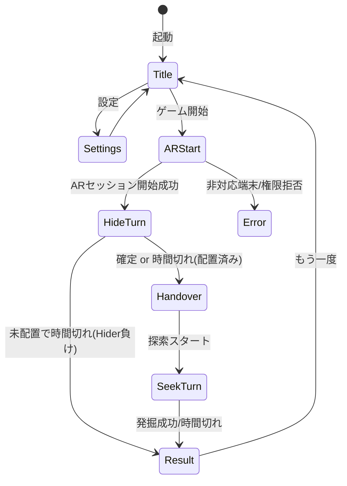

# 室内AR宝探しゲーム 仕様書

## 1. 概要

室内で2人が1台のAndroid端末を交互に使い、ARで宝箱を「隠す」「見つける」を競うWebアプリ。
サーバー不要の完全クライアントサイド構成(静的サイト)。

## 2. 実現可能性の結論

**実現可能性: 高い。** 以下の構成により、有償SDKなし・Web標準技術のみで成立する。

| 要件 | 実現手段 | 判定 |
|---|---|---|
| ブラウザでのAR表示 | WebXR Device API `immersive-ar` セッション(Android Chrome) | ◎ |
| タップ位置を実空間の3D点に変換 | WebXR Hit Test API(`transient-input` hit test) | ◎ |
| 宝箱位置の空間固定 | WebXR Anchors API(非対応端末はワールド座標固定にフォールバック) | ◎ |
| プレイヤーと宝箱の物理距離測定 | 6DoFトラッキングによるビューア姿勢と宝箱アンカーの距離計算 | ◎ |
| レーダーの色・音フィードバック | CSS/Canvas + Web Audio API | ◎ |
| 隠す側→見つける側の座標共有 | 1台手渡し・単一ARセッション継続により座標系を共有 | ◎ |

### 前提条件・制約(重要)

- **対象端末**: ARCore対応のAndroid + Chrome(またはChromium系)。iOS Safariは WebXR AR 非対応のため対象外。
- **HTTPS必須**: WebXRとカメラはセキュアコンテキストでのみ動作。開発時は `localhost` 可。
- **ARセッションの継続が生命線**: セッションが切れる(タブ切替・画面OFF・リロード)と空間座標系が失われ、宝箱の位置が無効になる。ゲーム中は画面を消さない運用ルールをUIで強制的に案内する。
- **トラッキングロス**: 急な動き・暗所・特徴の少ない壁面でトラッキングが劣化しうる。`emulatedPosition` を監視し、劣化時は警告表示。復帰不能ならゲーム無効(引き分け)として再スタートを促す。

## 3. ゲームルール

### 3.1 構成
- 1局完結。宝箱は1個。
- プレイヤー: 隠す側(Hider)1名、見つける側(Seeker)1名。
- 勝敗:
  - 見つける側が制限時間内に発掘成功 → **見つける側の勝ち**
  - 時間切れ → **隠す側の勝ち**
  - 隠す側が1度も宝箱を置かずに時間切れ → **隠す側の負け**
  - トラッキング復帰不能 → 無効試合(引き分け)

### 3.2 隠すターン(Hider)
- 制限時間: **デフォルト60秒**(設定変更可)。残り時間を常時表示。
- カメラ映像上をタップ → hit-test で実面(床・壁・家具の面)上の3D点を取得し、宝箱の3Dモデルを配置。
- **置き直し可**: 再タップするたびに宝箱が移動。「ここに隠す(確定)」ボタンで確定。
- 時間切れ時は最後に置いた位置で自動確定。
- hit-test が面を検出できないタップは無効(「平面を検出できません。少し端末を動かしてください」とトースト表示)。
- 確定後、宝箱モデルは非表示化し、手渡し画面へ遷移。

### 3.3 手渡しフェーズ
- 全面不透明の待機画面を表示(カメラ映像・宝箱位置は一切見えない)。
- 「⚠ 画面を消したり端末を伏せたりしないでください(宝の位置が失われます)」の警告を常時表示。
- 見つける側が「探索スタート」ボタンを押すと探索ターン開始。
- ARセッションは裏で維持し続ける。

### 3.4 見つけるターン(Seeker)
- 制限時間: **デフォルト180秒**(設定変更可)。残り時間を常時表示。
- カメラ映像上をタップ → hit-test で3D点を取得し、宝箱アンカーとの**3D距離**で判定。
  - 距離 ≤ **成功半径(デフォルト50cm、設定変更可)** → 発掘成功。宝箱が出現する演出+ファンファーレ。
  - 失敗 → 「ハズレ」演出(土煙エフェクト+効果音)。
- **発掘クールダウン**: 失敗後 **デフォルト3秒**(設定変更可)は再発掘不可。クールダウン中は画面にリング状の残り時間を表示し、タップを受け付けない(レーダーは使用可)。
- 面が検出できないタップは発掘試行と見なさず、クールダウンも発生しない。

### 3.5 レーダー
- 見つける側専用。**回数無制限、ボタン長押し中のみ作動**。
- 判定距離: **端末(プレイヤー)の現在位置と宝箱アンカーの3D距離**(タップ位置ではない)。毎フレーム更新。
- フィードバック(距離しきい値は設定変更可):

| 距離 | 色(画面縁のグロー) | 音 |
|---|---|---|
| > 3.0m | 青 | ピッ … 2秒間隔 |
| 1.5〜3.0m | 黄 | ピッ … 1秒間隔 |
| 0.5〜1.5m | 橙 | ピピッ … 0.4秒間隔 |
| ≤ 0.5m | 赤 | ピピピ連続音+バイブレーション |

- 音は Web Audio API のオシレータで生成(音源ファイル不要)。距離に応じて周波数も連続的に上げる(遠500Hz→近1200Hz)。
- レーダー使用中も移動・発掘は可能。

## 4. 設定項目(設定画面)

| 項目 | デフォルト | 範囲 |
|---|---|---|
| 隠す時間 | 60秒 | 15〜300秒 |
| 探す時間 | 180秒 | 30〜600秒 |
| 成功半径 | 50cm | 20〜150cm |
| 発掘クールダウン | 3秒 | 0〜10秒 |
| レーダーしきい値(近/中/遠) | 0.5 / 1.5 / 3.0 m | 各調整可 |
| 効果音・バイブ | ON | ON/OFF |

- 設定は `localStorage` に保存し次回起動時に復元。

## 5. 画面遷移



- **Title**: 遊び方説明・「ゲーム開始」「設定」。WebXR非対応環境では開始ボタンを無効化し理由を表示。
- **Error**: 非対応端末・カメラ権限拒否・セッション開始失敗の案内。
- **Result**: 勝者表示、宝箱の実際の位置をAR上で公開(ネタバラシ演出)、「もう一度」。

## 6. 技術仕様

### 6.1 スタック
- **Three.js + 素のWebXR Device API**、Vite + TypeScript。
- バックエンド不要(ゲーム状態はすべて端末のブラウザ内で完結)。ビルド成果物(HTML/JS/CSS)を静的ホスティングで配信する。
- ホスティング: **Vercel**(自動HTTPS。WebXR/カメラのセキュアコンテキスト要件を満たす)。
- 依存: `three` のみ(音はWeb Audio、UIはDOMオーバーレイ)。

### 6.2 使用するWebXR機能
- `navigator.xr.requestSession('immersive-ar', { requiredFeatures: ['hit-test', 'dom-overlay'], optionalFeatures: ['anchors'], domOverlay: { root: ... } })`
- **DOM Overlay**: タイマー・ボタン・手渡し画面などのUIをHTML/CSSでARビュー上に重ねる。
- **Hit Test**: タップ時に `XRTransientInputHitTestSource`(`select` イベント + viewer空間レイ)で面上の `XRPose` を取得。
- **Anchors**(optional): 対応端末では `XRHitTestResult.createAnchor()` で宝箱を空間固定。非対応時はヒット時のワールド座標をそのまま保持(短時間・室内なら実用上十分)。
- 毎フレーム `XRFrame.getViewerPose()` から端末位置を取得し、宝箱との距離を計算(レーダー用)。

### 6.3 主要モジュール構成

```
src/
  main.ts            // エントリ、画面遷移制御
  ar/session.ts      // XRセッション管理、フレームループ、トラッキング監視
  ar/hitTest.ts      // タップ→3D点変換
  ar/anchor.ts       // 宝箱アンカー管理(anchors有無のフォールバック込み)
  game/state.ts      // ゲーム状態機械(Title/Hide/Handover/Seek/Result)
  game/timer.ts      // ターンタイマー
  game/judge.ts      // 発掘判定(距離・クールダウン)
  game/radar.ts      // 距離→色/音マッピング
  audio/beeper.ts    // Web Audio オシレータ
  ui/overlay.ts      // DOMオーバーレイUI
  settings.ts        // 設定の保存/復元
```

### 6.4 判定ロジック(発掘)
1. `select` イベントで transient hit-test 結果を取得。
2. 先頭結果のワールド座標 `p_tap` を得る(結果なし→無効タップ)。
3. `distance(p_tap, p_treasure) <= successRadius` なら成功。
4. 失敗ならクールダウン開始。

### 6.5 アセット方針
- **宝箱3Dモデル**: Three.jsのプリミティブ(Box + 蓋の回転アニメーション)で自作する。外部モデルを使う場合は**CC0ライセンスのglTFのみ**可とし、出所URLを本ファイルに記録する。権利不明のアセットは使用禁止。
- **効果音**: すべてWeb Audio APIのオシレータで動的生成(音源ファイルを持たない)。レーダー音・発掘成功ファンファーレ・ハズレ音を含む。
- **フォント**: システムフォントのみ(Webフォントを読み込まない)。CSPの `default-src 'self'` とも整合し、読み込みも高速。
- **画像**: アイコン・OGP画像は自作し、リポジトリに含める。
- **外部アセットの取得ルール**: Webサイトから画像・音声等のアセットを取得して利用する場合は、**商用利用可能なライセンス(CC0、CC-BY、または配布元が商用利用可と明示するもの)に限定**する。取得時は出所URL・ライセンス種別を本セクションに記録し、CC-BY等の表示義務があるものはクレジット表記を行う。ライセンス不明・非商用限定のアセットは使用禁止。

### 6.6 パフォーマンス・バッテリー方針
ARは発熱・電池消費が大きい。探索3分×複数局の連続プレイを想定し、以下を守る:
- 影(シャドウマップ)は使用しない。ライティングは環境光+平行光源のみ。
- シーン内の描画物は宝箱1個+演出パーティクル程度に抑える(目標: 常時60fps)。
- `renderer.setPixelRatio` は最大1.5に制限する。
- レーダーのビープはオシレータを都度生成せず使い回す(GCによるカクつき防止)。
- ポストプロセスは使用しない。画面縁のグローはDOMオーバーレイのCSSで実現する。

### 6.7 リスクと対策

| リスク | 対策 |
|---|---|
| セッション中断で座標喪失 | Screen Wake Lock APIで画面消灯を抑止。`visibilitychange`/セッションend検知で無効試合処理。 |
| hit-testの誤差・面未検出 | 無効タップはノーカウント。プレイ前に「床をゆっくり見回して」チュートリアル表示。 |
| ガラス面・暗所での精度低下 | タイトル画面の遊び方に環境条件を明記。 |
| 覗き見(手渡し中・隠し中) | 技術では防止不可。「隠している間は後ろを向いて待つ」を運用ルールとしてUI上で案内。 |

## 7. デプロイと動作確認

### 7.1 本番公開(Vercel)
- GitHubリポジトリをVercelに連携し、`main` ブランチへのpushで自動デプロイ。
- ビルド設定: Framework Preset = **Vite**(Build Command `vite build` / Output Directory `dist` が自動設定される)。
- 公開URL(`https://<project>.vercel.app`)にAndroid Chromeでアクセスして利用。HTTPSは自動付与。
- **独自ドメインは使用しない**(`*.vercel.app` のままとする)。個人利用のゲームでありドメイン費用・DNS管理のコストに見合わない。将来必要になればVercelのダッシュボードから追加可能。
- 環境変数・サーバー設定は不要(静的配信のみ)。

### 7.2 メタ情報・SEO/OGP方針
方針: **検索エンジンからの流入は狙わない(SEOは深追いしない)が、インデックスは拒否せず、URL共有時の見栄え(OGP)のみ整える。**
- `index.html` に以下を設定する:
  - `<title>`: 「AR宝探し - 室内で遊ぶARトレジャーハント」
  - `meta description`: 1〜2文でゲーム内容と対応環境(Android Chrome)を記載
  - OGP: `og:title` / `og:description` / `og:image`(1200×630の自作画像) / `og:type=website` / `og:url`、および `twitter:card=summary_large_image`。LINE・X等でURLを共有した際にゲームのサムネイルが表示されることを目的とする。
  - `<meta name="viewport" content="width=device-width, initial-scale=1, user-scalable=no">`(ゲーム中の誤ピンチズーム防止)
  - favicon(自作)
- `robots.txt` は全許可で設置(`noindex` にはしない。遊びたい人が検索で辿り着けることを妨げない)。
- SPAのためSSR/プリレンダリング等の本格SEOは行わない。クローラが読むのは `index.html` の静的メタ情報のみで十分とする。

### 7.3 開発時の実機確認
本番同様HTTPSが必要(`localhost` のみ例外)。いずれかの方法を使う:
1. **USB接続 + adb reverse(推奨)**: PCで `vite dev` を起動し、`adb reverse tcp:5173 tcp:5173` を実行。Android側から `http://localhost:5173` でアクセスできるため証明書警告が出ない。
2. **同一Wi-Fi + 自己署名HTTPS**: `vite-plugin-basic-ssl` を導入し `vite dev --host` で起動、端末から `https://<PCのIP>:5173` にアクセス(初回に証明書警告を許可)。
3. **Vercelプレビューデプロイ**: PRごとに発行されるプレビューURLで実機確認する(ビルドを挟むため反復は遅い)。

## 8. セキュリティ・プライバシー要件

### 8.1 カメラ映像の取り扱い(プライバシー)
- カメラ映像はWebXR(`immersive-ar`)によりブラウザ/ARCoreが端末内で合成表示するのみで、**アプリのコードから生の映像データにはアクセスしない**(`raw-camera-access` 機能は要求しない)。
- カメラ映像・空間情報の**録画・保存・外部送信は一切行わない**。処理はすべて端末内で完結する。
- 上記の旨をタイトル画面(遊び方説明)に明記し、ユーザーに提示する。
- アナリティクス・トラッキング等のサードパーティスクリプトは導入しない。
- **エラー監視サービス(Sentry等)も導入しない**。外部送信ゼロの方針およびCSP(`connect-src 'self'`)と矛盾するため。不具合の把握はユーザー報告と実機での再現確認で行う。デバッグ用に画面内に開ける簡易ログ表示(端末内のみ、送信なし)を実装してよい。

### 8.2 配信時のセキュリティヘッダー
外部リソースを一切参照しない構成のため、厳格なヘッダーを `vercel.json` で全パスに付与する:

```json
{
  "headers": [
    {
      "source": "/(.*)",
      "headers": [
        { "key": "Content-Security-Policy",
          "value": "default-src 'self'; script-src 'self'; style-src 'self' 'unsafe-inline'; img-src 'self' data:; connect-src 'self'; frame-ancestors 'none'; base-uri 'none'; object-src 'none'" },
        { "key": "X-Content-Type-Options", "value": "nosniff" },
        { "key": "Referrer-Policy", "value": "no-referrer" },
        { "key": "Permissions-Policy", "value": "camera=(self), xr-spatial-tracking=(self), microphone=(), geolocation=()" }
      ]
    }
  ]
}
```

- `frame-ancestors 'none'` によりiframe埋め込み(クリックジャッキング)を拒否する。
- HTTPSはVercelが強制(HTTP→HTTPSリダイレクト)。

### 8.3 サプライチェーン対策
- 実行時依存は `three` のみに保つ。追加する場合は必要性をSPEC.mdに記録する。
- lockfile(`package-lock.json`)を必ずコミットし、CI/ローカルでは `npm ci` を使う。
- GitHubリポジトリでDependabot(security updates)を有効化し、`npm audit` を定期的に実行する。
- 外部CDNからのスクリプト読み込みは禁止(すべてバンドルして自己配信。CSPでも強制される)。

### 8.4 実装規約
- **XSS防止**: DOM操作で `innerHTML` に動的値を渡さない。テキストは `textContent` で設定する(本アプリにユーザー入力の表示箇所はほぼ無いが規約として徹底)。
- **localStorage の検証**: 設定値の読み込み時は型・範囲(セクション4の表の範囲)を検証し、不正値はデフォルトにフォールバックする。改ざんの影響は自端末のゲーム体験に限られるが、パースエラーでの起動不能を防ぐ。
- **シークレット管理**: リポジトリにAPIキー等の秘密情報をコミットしない(本アプリは秘密情報を必要としない構成を維持する)。Vercelのトークン類はVercel側で管理する。

### 8.5 スコープ外(該当なしと判断した項目)
- 認証・認可: ユーザーアカウントを持たない。
- API保護: バックエンドが存在しない。
- 対戦の不正(チート)対策: 同一端末での対面プレイでありセキュリティ要件ではなくゲームデザインの範疇。

## 9. アクセシビリティ・UI要件

### 9.1 色だけに依存しない情報伝達
- レーダーの距離フィードバックは**色・音・振動・形状の4チャネルで冗長化**する。色覚多様性があっても音の間隔/周波数・バイブパターンだけで宝箱に辿り着けること。
- 色に加えて、画面縁グローの**太さ**(遠=細い→近=太い)と**点滅速度**(遠=ゆっくり→近=速い)も距離に連動させる。色の判別ができなくても視覚だけで距離感が伝わるようにする。
- 効果音OFF設定時でもバイブと視覚フィードバックのみでプレイ可能であること。

### 9.2 操作性
- タップ可能なUI(レーダーボタン・確定ボタン等)は**最小48×48px**とする。
- レーダーボタンは**長押ししたまま歩き回る**操作なので、画面下部の親指が自然に届く位置に大きく(直径72px以上)配置する。左右どちらの手でも使えるよう、左右位置の入替設定を設ける…のはMVP後とし、MVPでは右下固定とする。
- ゲーム中の誤操作防止: ダブルタップズーム・ピンチズーム・スクロールを無効化(`touch-action: none` + viewport設定)。

### 9.3 画面向き・表示
- **縦向き(portrait)固定**。横向き時は「縦向きでご利用ください」のオーバーレイを表示する(Screen Orientation APIのロックはフルスクリーン時のみ有効なため、CSSメディアクエリでの案内を基本とする)。
- タイマー・残り回数等のテキストは背景のカメラ映像に埋もれないよう、半透明の座布団(背景ボックス)付きで表示し、コントラスト比4.5:1以上を確保する。

### 9.4 エラー画面の案内
- WebXR非対応・カメラ権限拒否時のエラー画面には、原因別の対処を明記する:
  - 非対応端末: 「ARCore対応端末一覧」(https://developers.google.com/ar/devices)へのリンクを表示
  - iOS: 「iPhoneのブラウザは本アプリのAR機能に非対応です」と明示
  - 権限拒否: Chromeのサイト設定からカメラ許可を再有効化する手順を表示

## 10. MVP実装順序

1. WebXRセッション起動 + hit-testで宝箱を置けるだけのプロトタイプ(実機検証を最優先)
2. ゲーム状態機械 + タイマー + 手渡し画面
3. 発掘判定 + クールダウン + 勝敗
4. レーダー(距離計算 + 色/音)
5. 設定画面 + 演出(発掘成功/失敗エフェクト、結果のネタバラシ)
6. 公開前の仕上げ: メタ情報/OGP(7.2)、セキュリティヘッダー(8.2)、アクセシビリティ・エラー画面要件(9章)の充足確認

## 11. 検討事項(MVP後の拡張候補)

MVPには含めないが、公開後に優先的に検討する項目:

- **PWA対応**: Web App Manifest(縦固定・`display: fullscreen`・アイコン)で「ホーム画面に追加」からのフルスクリーン起動を可能にする。Service Workerでアセットをキャッシュし完全オフライン化する。導入時はキャッシュ更新戦略(新バージョン検知と「更新があります」表示)の設計が必須。
- **プライバシーポリシーページ**: セクション8.1の内容(カメラ映像を保存・送信しない等)をユーザー向けの平易な文章にした静的ページを追加し、タイトル画面からリンクする。OSSライセンス表記(three.js: MIT)も同ページに掲載する。
- **テスト体制の整備**: ゲームロジック(発掘判定・タイマー・レーダー距離マッピング・設定値検証)はVitestでユニットテスト化。WebXR依存部分は自動化が困難なため、実機での手動テストチェックリスト(セッション開始/配置/手渡し/発掘/時間切れ/トラッキングロス/権限拒否の各系統)を `docs/` に整備し、リリース前に消化する。
- **レーダーボタンの左右位置入替設定**(左利き対応)。

## 12. 将来拡張(今回はスコープ外、設計上の配慮のみ)

- 2台対戦: 座標系共有の抽象化レイヤーを `ar/anchor.ts` に閉じ込めておく(QRコード原点合わせ + WebRTC/WebSocket同期を想定)。
- 交代戦・スコア制、宝箱複数個: `game/state.ts` の状態機械をラウンド対応可能な構造にしておく。
